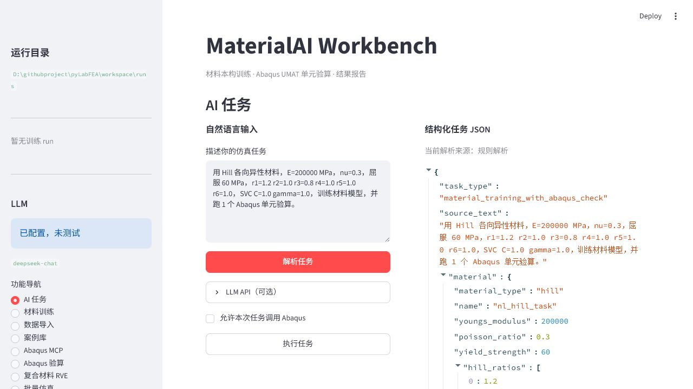
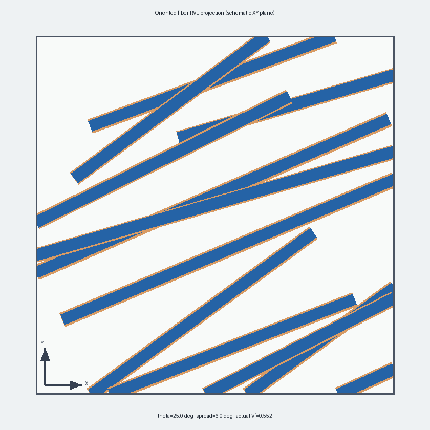

# MaterialAI Workbench

[](https://github.com/hwu12sluedu/MaterialAI-Workbench/actions/workflows/ci.yml)
[](https://github.com/hwu12sluedu/MaterialAI-Workbench/releases/latest)
[](LICENSE)

面向材料与仿真工程师的本地工作台，用于材料模型实验、Abaqus 工作流、仿真数据归档和代理模型训练。



## Windows 客户端

[从 Releases 下载最新 Windows x64 便携版](https://github.com/hwu12sluedu/MaterialAI-Workbench/releases/latest)

1. 下载 `MaterialAI-Workbench-Windows-x64-*.zip`。
2. 完整解压后打开 `MaterialAIWorkbench` 文件夹，双击 `MaterialAIWorkbench.exe`。
3. 首次启动需要加载数值计算组件，通常需要 20-60 秒。

便携版已经包含 Python 运行环境。基础材料训练、数据导入、案例管理和结果浏览不要求安装 Python。Abaqus 求解、ODB 读取和 CAE 实时连接仍需要用户自己的 Abaqus 安装与有效许可证。

用户数据不会写进程序目录：

```text
%LOCALAPPDATA%\MaterialAIWorkbench\workspace   案例、数据集和计算结果
%LOCALAPPDATA%\MaterialAIWorkbench\config      本地配置
%LOCALAPPDATA%\MaterialAIWorkbench\logs        启动与服务日志
```

## 主要功能

| 模块 | 当前实现 |
|---|---|
| 材料模型 | J2、Hill、Barlat 屈服实验；Neo-Hookean、Mooney-Rivlin 曲线；pyLabFEA SVM/神经网络实验 |
| 数据导入 | 实验应力-应变曲线和 Abaqus CSV 校验、归一化、预览与训练配置转换 |
| 系统诊断 | 分别检查用户工作区、Abaqus 批处理运行时、SMAPython 与 MCP 实时桥接 |
| Abaqus 验证 | UMAT 单元验算、INP/脚本生成、Job 队列、ODB 场变量与帧序列提取 |
| 三维验收算例 | 带孔板参数化建模、真实 Job、ODB 特征、工程检查、断点恢复和案例归档 |
| 带孔板批量 | 孔径/屈服强度/位移参数矩阵、可恢复 Abaqus 样本、质量门数据集、RF/MLP/GBR 对比 |
| CAE 实时连接 | 通过 Abaqus MCP Socket Bridge 查询模型和 Job、提交作业、读取 ODB、保存视口截图 |
| 复合材料 | 带取向的 Fiber/Interface/Matrix 三相体素 RVE、六工况数据准备、三维带孔板验证脚本 |
| 案例与模型 | `case_package.json` v2、文件指纹、求解证据、显式单位、可解释相似案例和训练质量门 |
| 任务输入 | 本地规则解析默认可用；外部模型可引用本地检索案例生成受约束计划，不能直接执行任意脚本或自动提交 Job |



## 工程边界

- 软件不会分发 Abaqus，也不会绕过许可证。
- 未安装 Abaqus 时，相关模块只生成可审查的 INP、脚本、任务计划和报告骨架，不伪造求解结果。
- 当前复合材料 RVE 是体素化微观模型；周期边界、网格收敛和材料参数仍需针对具体研究完成验证。
- 小样本代理模型指标用于检查数据链路，不能直接作为工业设计许用值。
- 自动生成的材料、模型和结果必须由具备资质的工程师复核。

更完整的限制见 [功能边界与验收说明](docs/CAPABILITY_BOUNDARIES_CN.md)。

## Abaqus 连接

实时连接步骤：

1. 打开 Abaqus/CAE。
2. 选择 `Plug-ins > Abaqus MCP > Start Socket Bridge`。
3. 在客户端的 `Abaqus MCP` 页面检查 `127.0.0.1:48152`。
4. 先读取模型与 Job 状态，再显式确认提交或后处理动作。

详细说明见 [Abaqus MCP 使用指南](docs/ABAQUS_MCP_WORKBENCH_CN.md)。

三维带孔板闭环可先准备、再显式提交，并严格区分 `prepared`、`built`、`solved`、`validated` 和 `archived`。操作与实机基线见 [Abaqus 三维带孔板闭环](docs/ABAQUS_CLOSED_LOOP_V03_CN.md)。

案例智能、自然语言复用和 3D 带孔板批量代理模型见 [v0.4 案例智能与批量仿真](docs/V04_CASE_INTELLIGENCE_CN.md)。

## 从源码运行

开发者和学习者可保留完整 Python 环境：

```powershell
git clone https://github.com/hwu12sluedu/MaterialAI-Workbench.git
cd MaterialAI-Workbench
conda env create -f environment.yml
conda activate pylabfea
python -m pip install -e ".[app,dev]"
materialai-streamlit
```

桌面壳调试：

```powershell
python -m pip install -e ".[app,desktop]"
materialai-desktop
```

本机验证：

```powershell
python -m pytest tests material_ai_workbench/tests -q -m "not slow"
python -m material_ai_workbench.desktop_launcher --smoke-test
python -m build
```

开发与打包细节见 [源码开发指南](docs/DEVELOPMENT_CN.md)。

## 文档

- [Windows 客户端使用与排错](docs/DESKTOP_CLIENT_CN.md)
- [功能边界与验收说明](docs/CAPABILITY_BOUNDARIES_CN.md)
- [Abaqus 三维带孔板闭环](docs/ABAQUS_CLOSED_LOOP_V03_CN.md)
- [v0.4 案例智能与批量仿真](docs/V04_CASE_INTELLIGENCE_CN.md)
- [功能软件测试清单](docs/testing/FUNCTIONAL_TEST_CHECKLIST_CN.md)
- [独立黑盒 QA 仓库](https://github.com/hwu12sluedu/MaterialAI-Workbench-QA)
- [案例库使用指南](docs/CASE_LIBRARY_USER_GUIDE_CN.md)
- [技术架构](docs/TECHNICAL_ARCHITECTURE_CN.md)
- [复合材料代理模型：从会用到学透](docs/learning/COMPOSITE_SURROGATE_MASTERY_CN.md)
- [pyLabFEA Notebook 与源码精读](docs/learning/PYLABFEA_NOTEBOOK_SOURCE_WALKTHROUGH_CN.md)
- [从 pyLabFEA 到有限元深度学习](docs/learning/PYLABFEA_TO_FE_DEEP_LEARNING_TUTORIAL_CN.md)
- [API 使用文档](docs/api/README_CN.md)

## 代码结构

```text
material_ai_workbench/   客户端、工作流、Abaqus、数据与代理模型
src/pylabfea/            内置 pyLabFEA 4.4.2 材料与有限元内核
notebooks/               pyLabFEA 学习 notebook
examples/                材料训练、CPFEM 和 UMAT 示例
packaging/windows/       Windows 便携客户端构建
tests/                   回归与集成测试
docs/                    中文使用、教学与 API 文档
```

## 许可

本仓库内置并修改了 [pyLabFEA 4.4.2](https://github.com/AHartmaier/pyLabFEA)，完整署名见 [NOTICE.md](NOTICE.md)。组合源代码按 GPL-3.0-or-later 发布；第三方条款见 [THIRD_PARTY_LICENSES](THIRD_PARTY_LICENSES)。Abaqus 是 Dassault Systemes 的专有软件，本项目与其官方产品无隶属关系。
