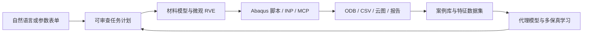

# MaterialAI Workbench

[](https://github.com/hwu12sluedu/MaterialAI-Workbench/actions/workflows/ci.yml)
[](https://github.com/hwu12sluedu/MaterialAI-Workbench/releases/tag/v0.1.0)
[](https://www.python.org/)
[](LICENSE)

面向机械与仿真工程师的本地 **CAE + 机器学习工作台**。项目以 pyLabFEA 为材料建模底座，把材料模型训练、复合材料微观 RVE、Abaqus 验证、案例沉淀、ODB/CSV 特征提取、代理模型和自然语言任务计划放进一个可追溯流程。

> 当前公开版本是 `v0.1.0` 工程 MVP。它能完整生成和管理工作流资产；真实 Abaqus 结果只在本机已安装、已授权并由用户明确提交求解后产生。


## 项目目标

日常仿真不应只留下散落的 CAE/ODB 文件。MaterialAI Workbench 的长期目标是把每个成功案例转成可检索、可复用、可训练的数据资产，并逐步形成能够辅助材料建模与有限元预测的工程智能系统。



## v0.1.0 能做什么

| 工作区 | 当前能力 | 真实边界 |
|---|---|---|
| 材料训练 | J2、Hill、Barlat 的 SVM/SVC 屈服模型实验；Neo-Hookean、Mooney-Rivlin 曲线与材料卡 | ML 屈服模型来自 pyLabFEA；超弹性当前不使用 SVC |
| 复合材料 | 带角度和离散度的 Fiber/Interface/Matrix 三相 RVE；统一生成 3D 图、2D 投影、phase map、体素 INP 和 ML 特征 | 当前是体素化微观模型；周期 wrap 与严格 PBC 仍需继续验证 |
| 宏观验证 | 自动生成三维带孔板 Abaqus 建模、求解和后处理脚本 | 无 Abaqus 时只生成脚本，不伪造求解结果 |
| Abaqus 集成 | UMAT 单元验算、Job 准备/队列、实时 MCP 查询、ODB 场变量与帧曲线提取、视口截图 | Abaqus 与 MCP 插件需在用户本机配置 |
| 数据资产 | 导入实验曲线和 Abaqus CSV；索引 INP/ODB/日志/报告；导出案例训练集 | 大型 ODB/CAE 保留在本地 `workspace/`，不进 Git |
| 机器学习 | Random Forest、MLP、时序代理和多保真基线；输出误差、预测图与报告 | 小样本演示指标只证明流程，不代表工业泛化精度 |
| AI 任务 | 规则解析或 OpenAI-compatible LLM 将自然语言转为结构化计划；确认后执行受支持步骤 | LLM 不直接获得不受控的 Abaqus 执行权限 |

## 快速开始

推荐 Windows + Conda，Abaqus 为可选项。

```powershell
git clone https://github.com/hwu12sluedu/MaterialAI-Workbench.git
cd MaterialAI-Workbench
conda env create -f environment.yml
conda activate pylabfea
python -m pip install -e ".[app,dev]"
```

启动图形工作台：

```powershell
materialai-streamlit
```

浏览器打开 `http://localhost:8501`。所有运行结果默认写入仓库根目录的 `workspace/`；安装为 wheel 时默认写入用户目录 `~/MaterialAIWorkbench/`。可以用 `MATERIALAI_WORKSPACE_ROOT` 覆盖。

## 一条命令跑通闭环

不调用 Abaqus 的发布级 smoke：

```powershell
materialai-product-closed-loop `
  --name github_smoke `
  --vf 0.55 `
  --fiber-theta 25 `
  --fiber-spread 6
```

它会生成：

- 可复现的 `fiber_layout.json` 与取向张量；
- Fiber/Interface/Matrix 体素 `phase_map.csv` 和微观 `INP`；
- 六个均匀化载荷工况文件；
- Abaqus 三维带孔板建模与 ODB 后处理脚本；
- 可直接进入代理模型的数据行；
- manifest、工程报告和产品闭环报告。

只有在确认本机 Abaqus 环境后才增加：

```powershell
materialai-product-closed-loop --run-abaqus --submit-job
```

## Abaqus 实时连接

1. 打开 Abaqus/CAE。
2. 选择 `Plug-ins > Abaqus MCP > Start Socket Bridge`。
3. 在 App 的 `Abaqus MCP` 工作区检查 `127.0.0.1:48152`。
4. 先读取模型、Job 和 ODB，再显式确认提交或后处理动作。

MCP 负责低延迟交互；批处理 `SMAPython.exe` 通道用于不依赖 CAE 窗口的 ODB 提取。详见 [Abaqus MCP 中文指南](docs/ABAQUS_MCP_WORKBENCH_CN.md)。

## 可选 LLM

复制 `.env.example` 为本地 `.env`，填入自己的供应商配置。支持 DeepSeek、OpenAI、通义千问、SiliconFlow、Ollama 和自定义 OpenAI-compatible 地址。

```text
MATERIALAI_LLM_PROVIDER=deepseek
MATERIALAI_LLM_BASE_URL=https://api.deepseek.com/v1
MATERIALAI_LLM_MODEL=deepseek-chat
MATERIALAI_LLM_API_KEY_ENV=DEEPSEEK_API_KEY
DEEPSEEK_API_KEY=your-local-key
```

`.env` 已被 Git 忽略。LLM 只负责生成结构化任务计划，外部 API 调用和 Abaqus 提交均由用户确认。

## 代码结构

```text
material_ai_workbench/   产品层：UI、工作流、Abaqus、数据与代理模型
src/pylabfea/            内置 pyLabFEA 4.4.2 材料与有限元底座
notebooks/               pyLabFEA 原始学习 notebook
examples/                材料训练、CPFEM 与 UMAT 示例
tests/                   产品与上游兼容性测试
docs/                    中文教学、API、架构与发布文档
workspace.example/       本地数据目录说明
```

## 验证

```powershell
python -m pytest tests material_ai_workbench/tests -q -m "not slow"
python -m build
python tools/release_audit.py
```

快速 CI 覆盖 Python 3.10、3.11、3.12，另有 Docker Streamlit 健康检查。耗时较长的上游 ML 重训练测试使用 `slow` 标记单独运行。

## 中文文档

- [产品与复合材料闭环](docs/PRODUCT_COMPOSITE_ML_WORKBENCH_CN.md)
- [技术架构](docs/TECHNICAL_ARCHITECTURE_CN.md)
- [学习入口](docs/learning/README_CN.md)
- [pyLabFEA Notebook 与源码精读](docs/learning/PYLABFEA_NOTEBOOK_SOURCE_WALKTHROUGH_CN.md)
- [从 pyLabFEA 到有限元深度学习](docs/learning/PYLABFEA_TO_FE_DEEP_LEARNING_TUTORIAL_CN.md)
- [API 使用](docs/api/README_CN.md)
- [LLM 配置](material_ai_workbench/docs/LLM_API_SETUP_CN.md)

## 已知限制与下一阶段

1. 把当前运动学均匀化工况升级为经 Abaqus 基准验证的严格周期性边界条件。
2. 增加真实圆柱几何网格、周期截断/wrap 与更高质量 RVE 生成算法。
3. 用持续积累的真实 Abaqus 案例建立训练/验证/测试拆分和不确定性评估。
4. 将自然语言任务扩展到更多可审查的参数化建模动作，不让 LLM 直接执行任意脚本。
5. 把本地 Web MVP 封装为稳定桌面客户端，同时保留 Python API 和 MCP 扩展能力。

## 上游、许可与免责声明

本仓库内置并修改了 [pyLabFEA 4.4.2](https://github.com/AHartmaier/pyLabFEA)，原作者为 Alexander Hartmaier、Ronak Shoghi、Jan Schmidt。完整署名见 [NOTICE.md](NOTICE.md)。组合源代码按 GPL-3.0-or-later 发布；上游示例、notebook 和文档在适用处保留其 CC BY-NC-SA 4.0 条款。

Abaqus 为 Dassault Systemes 的专有软件，本项目不分发 Abaqus，也不代表其官方产品。任何材料模型、代理预测或自动生成仿真都必须由具备资质的工程师复核后用于工程决策。
